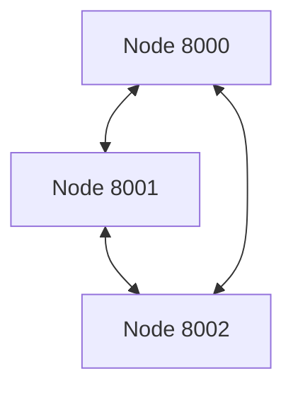

# P2P Blockchain Network

A fully functional peer-to-peer blockchain network simulation using FastAPI, supporting mining, transactions, consensus, and real-time updates.

## Features
- Decentralized blockchain with mining and proof-of-work
- Peer-to-peer node discovery and registration
- Real-time dashboard with WebSocket updates
- Async network communication and consensus
- Interactive API docs (Swagger UI)

## File Structure
- `blockchain.py` - Blockchain core logic
- `node.py` - FastAPI node server
- `models.py` - Pydantic models
- `run_network.py` - Multi-node launcher
- `templates/index.html` - Dashboard
- `requirements.txt` - Dependencies

## Setup
1. **Install dependencies:**
   ```bash
   pip install -r requirements.txt
   ```
2. **Run multiple nodes:**
   ```bash
   python run_network.py 3 8000
   ```
   This starts 3 nodes on ports 8000, 8001, 8002.

3. **Access dashboard:**
   - [http://localhost:8000](http://localhost:8000)
   - [http://localhost:8001](http://localhost:8001)
   - [http://localhost:8002](http://localhost:8002)

4. **Swagger UI:**
   - [http://localhost:8000/docs](http://localhost:8000/docs)

## Example API Usage
- Register peers:
  ```bash
  curl -X POST "http://localhost:8000/nodes/register" -H "Content-Type: application/json" -d '{"nodes": ["127.0.0.1:8001", "127.0.0.1:8002"]}'
  ```
- Add transaction:
  ```bash
  curl -X POST "http://localhost:8000/transactions/new" -H "Content-Type: application/json" -d '{"sender": "alice", "recipient": "bob", "amount": 5}'
  ```
- Mine block:
  ```bash
  curl "http://localhost:8000/mine"
  ```
- Trigger consensus:
  ```bash
  curl "http://localhost:8000/nodes/resolve"
  ```

## Network Topology Diagram



## Troubleshooting
- **Port in use:** Change base port in `run_network.py`.
- **Node not syncing:** Ensure all nodes are registered as peers.
- **WebSocket not connecting:** Check browser and firewall settings.

## Testing Scenarios
- Add transactions on different nodes and mine blocks
- Register nodes and trigger consensus
- Simulate network partition by stopping/restarting nodes

## License
MIT 

## Uploading to GitHub

1. **Initialize a git repository (if you haven't already):**
   ```bash
   git init
   ```
2. **Add all files:**
   ```bash
   git add .
   ```
3. **Commit your changes:**
   ```bash
   git commit -m "Initial commit"
   ```
4. **Create a new repository on GitHub.**
   - Go to https://github.com/new and follow the instructions.
5. **Add the remote origin:**
   ```bash
   git remote add origin https://github.com/your-username/your-repo-name.git
   ```
6. **Push to GitHub:**
   ```bash
   git push -u origin master
   ```

Replace `your-username` and `your-repo-name` with your actual GitHub username and repository name. 